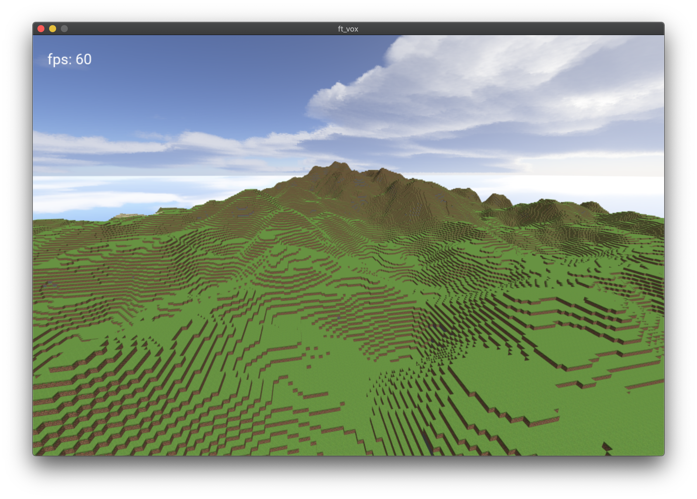

# ft_vox

ft_vox is a simple Voxel demo written in C++ using OpenGL made by [baudiber](https://github.com/baudiber) and [gsmith](https://github.com/guilhemSmith).

  

## Compilation from sources
### git-lfs
Textures and font files are stored with [git-lfs](https://git-lfs.github.com/).  
Make sure it is installed before cloning.
### On macOs and Linux
* `./setup.sh` to install external dependencies. On Mac it is advised to have brew already installed.  
* `mkdir build && cd build`
* then `cmake .. && make` or `cmake .. && cmake --build .`  

When the build is done, the executable file `ft_vox` and its `resources` folder should be located in the build folder.  
To move them somewhere else on your system, always keep the binary and the resources folder together in the same dir.  
_example: `cp -R ft_vox resources ~/mygamefolder/voxdemo`_

## Usage  
### Launch
`./ft_vox` will launch the demo with a random seed.  
The seed used is always printed in the terminal.  

_You can also give ft_vox a seed that you like_     
`./ft_vox your_seed`   
_example: `./ft_vox 1603917848`_    

### controls
On qwerty keyboard: 
| key              | effect        |
| ---------------- | ------------- |
| <kbd>w</kbd>     | move forward  |
| <kbd>a</kbd>     | move backward |
| <kbd>s</kbd>     | move left     |
| <kbd>d</kbd>     | move right    |
| <kbd>space</kbd> | move up       |
| <kbd>ctrl</kbd>  | move down     |
| <kbd>shift</kbd> | sprint        |
| <kbd>f</kbd>     | screen mode   |
| <kbd>esc</kbd>   | quit demo     |
